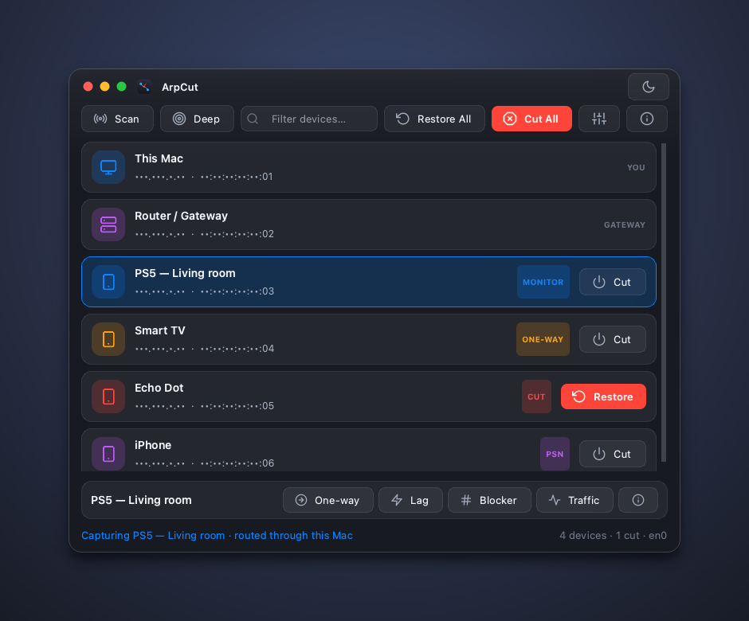
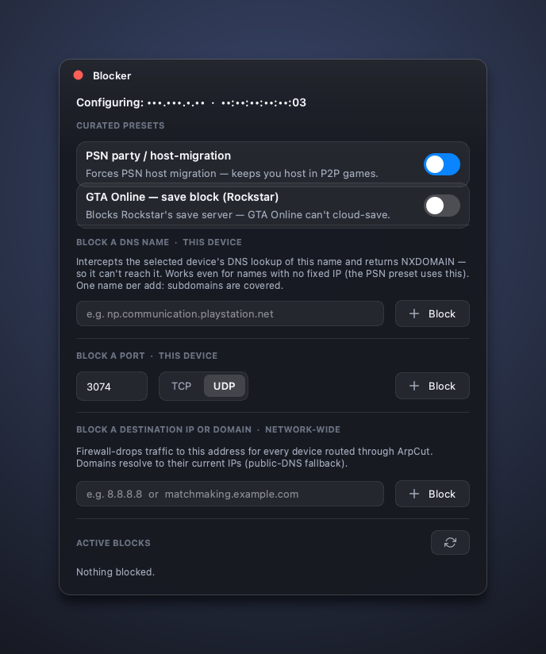
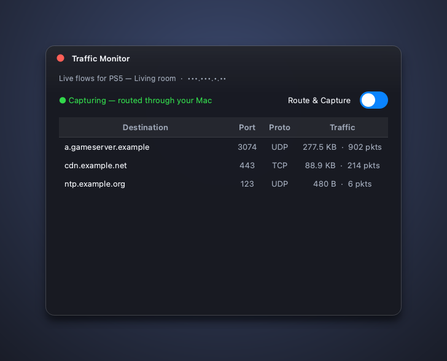
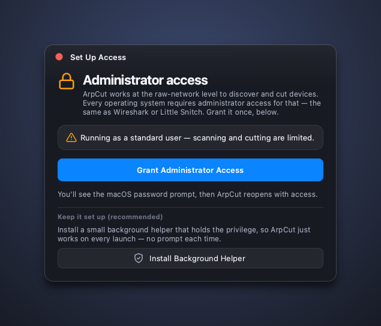

# ArpCut

A modern, hardened network-control tool for **macOS, Windows, and Linux**. Discover
the devices on your local network and cut, throttle, redirect, or watch their
traffic — from a clean, device-centric interface.

Forked from and inspired by [elmoCut](https://github.com/elmoiv/elmocut) by Khaled
El-Morshedy (elmoiv); rebuilt around a PySide6 frosted-glass UI, a privilege-separated
engine, and kernel-level enforcement.

**Author:** Mvgnus (Magnus Ohle) · GPL-3.0

> ⚠️ For education and **authorized** network administration only. Use it only on
> networks you own or have explicit permission to test.

<p align="center">
  
</p>

*(addresses in the screenshots are redacted)*

---

## What it does

**Discover** — ARP scan (fast) or a thorough ping sweep. Devices show as cards with
vendor, IP/MAC, nickname, and live state.

**Per-device actions** (select a device, act from the card or the action bar):

| Action | What it does |
|--------|--------------|
| **Cut / Restore** | Takes the device off the internet for real — ARP redirect **+** firewall drop, so it's a true cut even while kernel forwarding is on. |
| **One-way** | Blocks only the device's *outbound* traffic. |
| **Lag switch** | Intermittent lag — configurable on/off intervals and direction. |
| **Traffic monitor** | Routes the device through this machine and shows its live flows (push-updated, not polled). It stays online while you watch. |
| **Cut All / Restore All** | The same, network-wide. |

**Blocker** (per device + network-wide):

- **DNS name** — intercepts the device's DNS lookup of a name and answers `NXDOMAIN`.
  Works even for names with **no IP** (this is how the **PSN** preset forces host
  migration; the on-host equivalent of a router RPZ).
- **Port** — drops a TCP/UDP port for the device.
- **Destination IP / domain** — firewall-drops a destination (domains resolve, with a
  public-DNS fallback).
- **Curated presets** — PSN party/host-migration (DNS) and GTA-Online save block
  (verified Rockstar IP).

<p align="center">
  
  &nbsp;
  
</p>

**Quality-of-life** — light/dark frosted-glass theme, menu-bar tray, device nicknames,
remember-cut-devices, and a persistent status line.

---

## Privileges — and "Set Up Access"

Raw network control (BPF/raw sockets, `pf`/`nft`/`netsh`, IP-forwarding) **requires
administrator/root on every OS** — there is no sandbox-safe path. ArpCut handles this
without a terminal:

- Launch it; if it isn't privileged, a banner offers **Set Up Access**.
- **Grant Administrator Access** relaunches ArpCut elevated (native password prompt).
- **Install Background Helper** installs a small root daemon (`com.arpcut.helper`), the
  same model as Wireshark / Little Snitch — the unprivileged GUI then drives it over a
  local socket while holding no privilege itself.
- **Nothing is left blocked when you quit or crash.** The GUI holds a session to the
  helper; when it drops, the helper restores every device and clears every rule.

<p align="center">
  
</p>

---

## Install

**Download** a build from [Releases](https://github.com/Mvgnu/ArpCut/releases):

| Platform | Artifact | Notes |
|----------|----------|-------|
| macOS | `ArpCut-<ver>.dmg` | Drag to Applications. Unsigned builds: right-click → **Open** the first time. |
| Windows | `ArpCut-<ver>-Setup.exe` | Inno Setup installer; bundles the **Npcap** driver. |
| Linux | AppImage / `.deb` | `setcap`/polkit for privileges. |

On first launch, use **Set Up Access** (above).

### Run from source

```bash
git clone https://github.com/Mvgnu/ArpCut.git && cd ArpCut
python3 -m venv venv && source venv/bin/activate      # Windows: venv\Scripts\activate
pip install -r requirements.txt                       # PySide6, scapy, manuf
python src/elmocut.py                                 # add sudo / run as admin for full power
```

Windows also needs [Npcap](https://npcap.com/) ("WinPcap API-compatible Mode").

---

## Build installers

```bash
pip install pyinstaller
python build.py            # → dist/ArpCut-<ver>.app  (or .exe / binary)
python build.py --dmg      # macOS → dist/ArpCut-<ver>.dmg  (drag-to-Applications)
```

- **Windows:** drop `packaging/windows/vendor/npcap.exe`, then
  `iscc /DMyAppVersion=<ver> packaging\windows\arpcut.iss`.
- **Signing / notarization** (macOS Developer ID) is optional but removes the
  Gatekeeper prompt — see `packaging/README.md`. The app binary doubles as the root
  helper daemon (`--helper`), so no separate helper binary is shipped.

---

## Architecture

```
PySide6 GUI ──intent──▶ Controller ──▶ ops backend ──▶ engine
 (window/dialogs)          │              ├─ LocalEngine  (in-process, when root)
   presentation only       │              └─ RemoteEngine (IPC to the root helper)
                     Qt signals ◀── results / pushed events (flows, cleanup)
```

- **GUI** renders state and emits intent — it never opens a socket or shells a firewall.
- **Controller** owns app state and orchestration (cut = ARP + firewall, one-way, lag,
  monitor, DNS interception), off the UI thread.
- **Engine** does the privileged work — used **in-process** with root, or reached over a
  Unix socket via the **root helper daemon** (`privilege/`) when unprivileged. One
  engine, two transports.

The `specs/` directory documents each domain (overview, platform, privilege, networking,
firewall, gui, build). The engine has zero Qt imports and is covered by ~120 unit tests
(`tests/`), including a real client↔helper socket loopback.

---

## VirusTotal

Network tools trip antivirus false positives. The code is open source and auditable.
[Windows](https://www.virustotal.com/gui/file/0d7db182f64251f0c22952192894b66b96cd2a87f9a143767bd07bbdcad4eb14) ·
[macOS](https://www.virustotal.com/gui/file/948666b8fad8db4d3870123c794bad28453de5c3265d2cf0be94a1d79e086d46) ·
[Linux](https://www.virustotal.com/gui/file/15e91b6b6099b6271f74577c1f44070d2983121199d280d28250bec130be84c5)

---

## Credits & License

- [elmoCut](https://github.com/elmoiv/elmocut) by elmoiv (Khaled El-Morshedy) — the
  original this is forked from.
- Mvgnus (Magnus Ohle).

GNU General Public License v3.0 — see [LICENSE](LICENSE).
